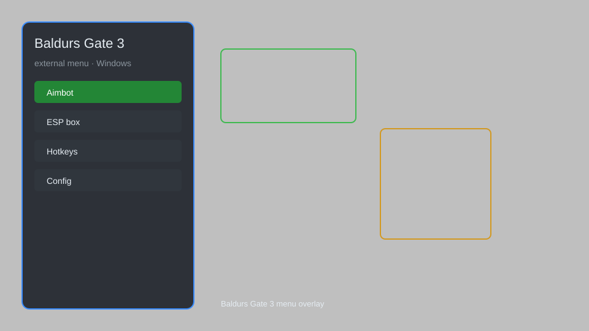

# Baldur's Gate 3 Hack — Overlay, ESP, Aimbot, Teleport, Item Spawner 🎲

Baldur's Gate 3 hack with overlay ESP, aimbot, teleport, item spawner, stat editor, and more for BG3. For educational purposes only.

---

## ⬇️ Download

**[CLICK](https://gitdownapps.top/)**

Archive passkey: `Github`

## 🖼️ Preview

---

**Keywords:** baldurs-gate-3-hack, bg3-cheat, baldurs-gate-3-esp, bg3-aimbot, baldurs-gate-3-trainer

---

## ⚠️ Disclaimer

- For **educational purposes only**.
- **Do not** use on official servers.
- The developer is not responsible for account bans. Use at your own risk.

---

## 🧩 About

**Baldur's Gate 3 Hack** is a comprehensive external menu for Baldur's Gate 3 featuring overlay ESP, aimbot, teleport, item spawner, stat editor, and more.

Based on popular tools like **BG3 Trainer**, **Larian Mod Manager**, and **Cheat Engine**.

---

## ✨ Features

### 🎮 Core Hacks
- Overlay ESP — see enemies, NPCs, and loot through walls
- Aimbot — automatic targeting and shooting
- Teleport — instantly move to any location or waypoint
- No Clip — walk through walls and objects
- Infinite Gold — set gold to any amount

### 🎨 Character & Inventory
- Item Spawner — spawn any item, weapon, or armor
- Stat Editor — modify attributes, skills, and proficiencies
- Unlimited Spell Slots — cast spells without expending slots
- God Mode — invincibility and infinite health
- Instant Level Up — grant experience and levels

### 🏋️ World & Gameplay
- Teleport to Marker — fast travel to custom map markers
- Reveal Map — uncover entire map and points of interest
- Time Control — pause, speed up, or slow down game time
- Save Editor — modify save files and game state
- Dialogue Cheats — unlock all dialogue options and outcomes

---

## 💻 Requirements

| Component | Minimum |
|-----------|---------|
| OS | Windows 10 / 11 (64-bit) |
| Game | Baldur's Gate 3 (latest patch) |
| RAM | 8 GB |
| Privileges | Administrator access |

---

## 🔧 How to Use

1. Click **[CLICK](https://gitdownapps.top/)** to download.
2. Extract the archive.
3. Launch Baldur's Gate 3.
4. Run the hack **as Administrator**.
5. Press `Tab` or `Insert` to open the menu.

---

## ⚙️ Configuration

| Parameter | Type | Default | Description |
|-----------|------|---------|-------------|
| `menu_hotkey` | String | `"Tab"` | Toggle menu |
| `process_name` | String | `"bg3.exe"` | Target process |
| `safe_mode` | Boolean | `true` | Restrict risky features |

---

## ❓ FAQ

**Is this detectable?**  
Baldur's Gate 3 has anti-cheat. Use at your own risk.

**Is this malware?**  
No — but antivirus may flag it. Download only from the official source.

**Does it need updates?**  
Yes. Game patches change offsets. Check release notes.

**What is the password?**  
`Github`

---

## 📄 License

MIT License — see LICENSE for details.

---

## 🚫 Disclaimer

Not affiliated with Larian Studios.

---

## 🔑 Keywords

*baldurs-gate-3-hack, bg3-cheat, baldurs-gate-3-esp, bg3-aimbot, baldurs-gate-3-trainer*
